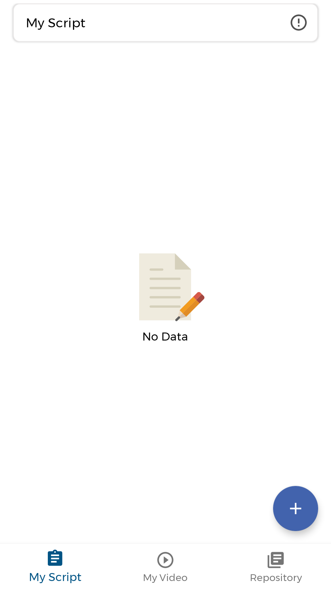
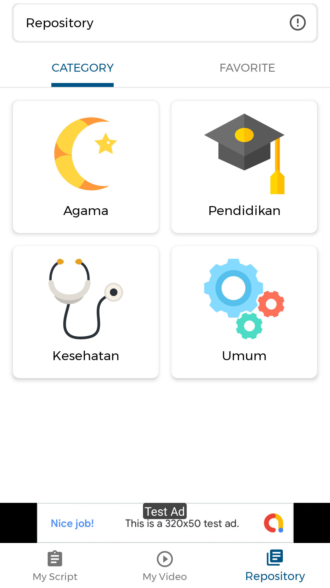
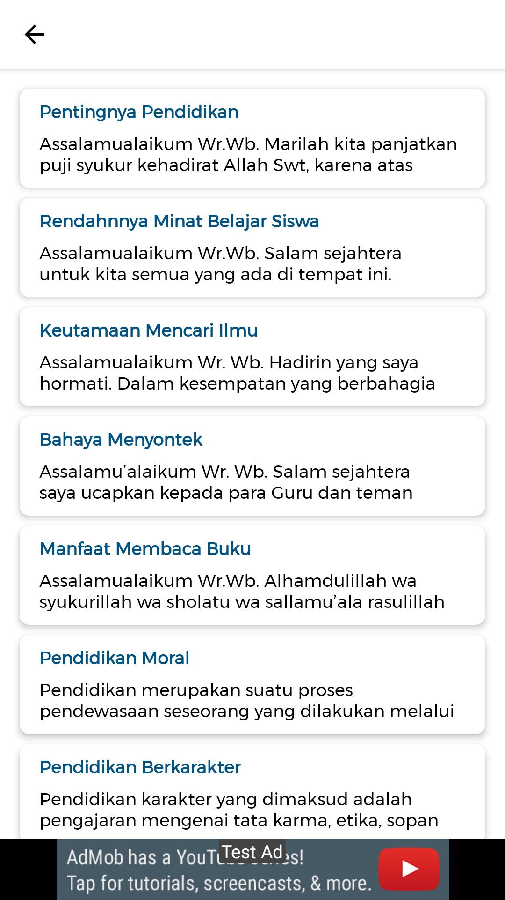

## Speech Booster
Speech Booster, Aplikasi Belajar Pidato
- Link PlayStore [Click Here](https://play.google.com/store/apps/details?id=com.frogobox.speechbooster)

## Screen Shoot

| UI 1 | UI 2 | UI 3 |
|:----:|:----:|:----:|
| |  |  |

## Version Release
This Is Latest Release

    $version_release = 1.0.0

## Colaborator
Very open to anyone, I'll write your name under this, please contribute by sending an email to me

- Mail To faisalamircs@gmail.com
- Subject : Github _ [Github-Username-Account] _ [Language] _ [Repository-Name]
- Example : Github_amirisback_kotlin_admob-helper-implementation

Name Of Contribute
- Muhammad Faisal Amir
- Saiful Apriyanto
- Waiting List

Waiting for your contribute

## Insipiration
- Belajar Pidato [Click Here](https://play.google.com/store/apps/details?id=org.d3ifcool.belajarpidato)

## Attention !!!
- Please enjoy and don't forget fork and give a star
- Don't Forget Follow My Github Account
